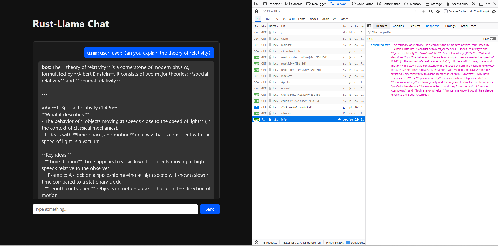

# Full-Stack AI Chat with Rust and React

download the gguf qwen3 and put into ai_api/models/qwen3.gguf directory

---


This project is a complete, self-hosted AI chat application. It features a high-performance Rust backend using `actix-web` and `llama_cpp_2` to run a local large language model (LLM), and a modern, responsive frontend built with React, TypeScript, and Vite.

The application is designed to be a starting point for building powerful, private, and efficient AI-powered tools without relying on third-party APIs.




## Features

-   **⚡️ High-Performance Backend:** Built with Rust and Actix Web for speed and memory safety.
-   **🧠 Local LLM Inference:** Runs a GGUF-compatible language model (like Qwen, Llama, or Mistral) directly on your machine. No API keys, no data leaves your system.
-   **💬 Conversational Context:** The chat remembers the conversation history, providing context for more coherent responses.
-   **📄 Qwen Prompt Templating:** The backend includes specific prompt formatting for Qwen models to ensure high-quality, structured conversations.
-   **⚛️ Modern Frontend:** A clean and simple chat interface built with React, TypeScript, and Vite.
-   **CORS Ready:** Pre-configured Cross-Origin Resource Sharing (CORS) to allow the frontend and backend to communicate during development.

## Tech Stack

-   **Backend (in `ai_api/`)**:
    -   [Rust](https://www.rust-lang.org/)
    -   [Actix Web](https://actix.rs/): A powerful, pragmatic, and extremely fast web framework.
    -   [llama-cpp-2](https://crates.io/crates/llama_cpp_2): Rust bindings for the `llama.cpp` library.
    -   [Serde](https://serde.rs/): For serializing and deserializing JSON data.
-   **Frontend (in `frontend/`)**:
    -   [React](https://reactjs.org/)
    -   [TypeScript](https://www.typescriptlang.org/)
    -   [Vite](https://vitejs.dev/): A next-generation frontend tooling.
    -   [pnpm](https://pnpm.io/): Fast, disk space-efficient package manager.

## Prerequisites

Before you begin, ensure you have the following installed on your system:

1.  **Rust Toolchain:** Install via [rustup](https://rustup.rs/).
2.  **C/C++ Build Tools:** `llama-cpp-2` compiles `llama.cpp` from source, which requires a C/C++ compiler.
    -   **Windows:** Install the "Desktop development with C++" workload from the [Visual Studio Installer](https://visualstudio.microsoft.com/downloads/).
    -   **macOS:** Install Xcode Command Line Tools: `xcode-select --install`.
    -   **Linux (Debian/Ubuntu):** `sudo apt-get update && sudo apt-get install build-essential`
3.  **Node.js and pnpm:** Install [Node.js](https://nodejs.org/) (v18+) and then install `pnpm` globally:
    ```bash
    npm install -g pnpm
    ```

## Getting Started

Follow these steps to get the application running locally.

### 1. Clone the Repository

```bash
git clone https://github.com/your-username/your-repo-name.git
cd your-repo-name
```

### 2. Download a Language Model

This project is configured for a Qwen model in GGUF format, but other models can work with adjustments to the prompt template.

-   Download a model like **Qwen3-0.6B-Q8_0.gguf** from Hugging Face unsloth
-   Place the downloaded `.gguf` file inside the `ai_api/models/` directory.

### 3. Configure the Backend

The path to the model is hardcoded in the backend. You **must** update it.

-   Open `ai_api/src/main.rs`.
-   Find the `main` function and locate the `LlamaModel::load_from_file` call.
-   Change the file path to match the model you downloaded.

```rust
// In ai_api/src/main.rs

// ...
    let model = LlamaModel::load_from_file(
        &backend,
        //
        // 🚨 CHANGE THIS PATH 🚨
        //
        "path/to/your/ai_api/models/your_model_name.gguf",
        &model_params,
    )?;
// ...
```

### 4. Run the Backend Server

Open a terminal in the `ai_api` directory and run the server.

```bash
cd ai_api

# Build and run the server (the first build will take a while)
# Using --release is recommended for better performance
cargo clean
cargo run --release
```

If successful, you will see the message:
`✅ Model loaded. Server starting at http://127.0.0.1:8080`

### 5. Run the Frontend Application

Open a **new terminal** in the `frontend` directory.

```bash
cd frontend

# Install dependencies
pnpm install

# Start the development server
pnpm dev
```

The frontend will start, typically on `http://localhost:5173`.

### 6. Configure CORS (if needed)

The backend is configured to accept requests from `http://localhost:3000`. Vite's default port is `5173`. You have two options:

1.  **(Recommended)** Change the allowed origin in the backend. In `ai_api/src/main.rs`, update the `Cors` configuration to match your frontend URL:
    ```rust
    // In ai_api/src/main.rs
    let cors = Cors::default()
        .allowed_origin("http://localhost:5173") // <-- Change this port
        .allowed_methods(vec!["POST"])
        // ...
    ```
2.  Start the Vite dev server on port 3000:
    ```bash
    pnpm dev --port 3000
    ```

### 7. Open the Chat!

Open your browser and navigate to the frontend URL (e.g., `http://localhost:5173`). You should now be able to chat with your local AI!

## How It Works

1.  **User Input:** The React frontend captures your message and adds it to the list of chat messages stored in its state.
2.  **API Request:** The entire conversation history is sent as a JSON payload to the backend's `POST /infer` endpoint.
3.  **Prompt Formatting:** The Rust backend receives the message list. It iterates through the messages and formats them into a single string using the **Qwen ChatML template**:
    ```
    <|im_start|>system
    You are a helpful assistant.<|im_end|>
    <|im_start|>user
    Hello, what is Rust?<|im_end|>
    <|im_start|>assistant
    ```
4.  **Inference:** The formatted prompt is tokenized and fed into the LLM using `llama_cpp_2`. The backend then generates a response token-by-token.
5.  **API Response:** The generated text is returned to the frontend in a JSON object.
6.  **UI Update:** The frontend receives the response, adds the bot's message to the chat history, and re-renders the UI to display it.

## License

This project is licensed under the MIT License. See the [LICENSE](LICENSE) file for details.